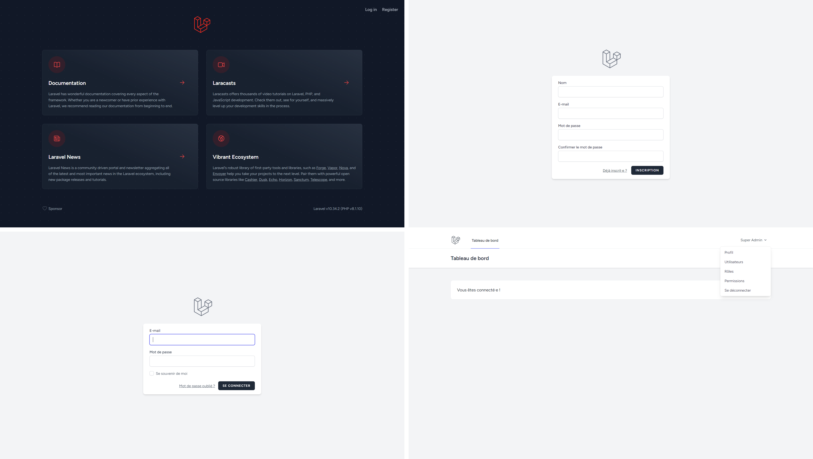

<p align="center"><a href="https://laravel.com" target="_blank"></a></p>

<p align="center">
<a href="https://github.com/laravel/framework/actions"></a>
<a href="https://packagist.org/packages/laravel/framework"></a>
<a href="https://packagist.org/packages/laravel/framework"></a>
<a href="https://packagist.org/packages/laravel/framework"></a>
</p>

# Laravel 10 Starter

<p align="center">
  
</p>

## About Laravel

Laravel is a web application framework with expressive, elegant syntax. We believe development must be an enjoyable and creative experience to be truly fulfilling. Laravel takes the pain out of development by easing common tasks used in many web projects, such as:

- [Simple, fast routing engine](https://laravel.com/docs/routing).
- [Powerful dependency injection container](https://laravel.com/docs/container).
- Multiple back-ends for [session](https://laravel.com/docs/session) and [cache](https://laravel.com/docs/cache) storage.
- Expressive, intuitive [database ORM](https://laravel.com/docs/eloquent).
- Database agnostic [schema migrations](https://laravel.com/docs/migrations).
- [Robust background job processing](https://laravel.com/docs/queues).
- [Real-time event broadcasting](https://laravel.com/docs/broadcasting).

Laravel is accessible, powerful, and provides tools required for large, robust applications.

## Learning Laravel

Laravel has the most extensive and thorough [documentation](https://laravel.com/docs) and video tutorial library of all modern web application frameworks, making it a breeze to get started with the framework.

You may also try the [Laravel Bootcamp](https://bootcamp.laravel.com), where you will be guided through building a modern Laravel application from scratch.

If you don't feel like reading, [Laracasts](https://laracasts.com) can help. Laracasts contains over 2000 video tutorials on a range of topics including Laravel, modern PHP, unit testing, and JavaScript. Boost your skills by digging into our comprehensive video library.
 
## Project creation process

Here is the abbreviated creation process of this project as well as the description of the integrated components, their installations and configurations.

Create a new Laravel project named `laravel-10-10-starter-kit`

```bash
composer create-project --prefer-dist laravel/laravel laravel-10-10-starter-kit
```

For more details, check out [Laravel Installation](https://laravel.com/docs/10.x/installation#creating-a-laravel-project) docs.

### Laravel-Breeze

Laravel Breeze was used for its comprehensive authentication system with pre-built views, providing a solid foundation and pre-built features. Here are the commands that facilitated its integration into the project.

```bash
# install Laravel Breeze (minimalist authentication) as a development dependency.
composer require laravel/breeze --dev

# install Laravel Breeze with Blade views for minimalist authentication scaffolding.
php artisan breeze:install blade

# run Laravel migrations to create database tables.
php artisan migrate

# install Node.js dependencies specified in the project's package.json file.
npm install
```

For a detailed explanation of how it works, see the [Laravel-Breeze](https://laravel.com/docs/10.x/starter-kits#breeze-and-blade) docs.

### Laravel-Permission Install & Setup

`spatie/laravel-permission` is a package developed by Spatie for the Laravel framework, facilitating the management of roles and permissions in applications. This package provides an elegant solution for establishing a robust authorization system in Laravel projects.

Key features of `spatie/laravel-permission` include the ability to create roles, assign permissions to roles, and check access to features based on roles or permissions. It also offers seamless integration with Laravel's user model.

```bash
# install Spatie Laravel Permission package.
composer require spatie/laravel-permission

# publish the package configuration.
php artisan vendor:publish --provider="Spatie\Permission\PermissionServiceProvider"

# clear optimization files.
php artisan optimize:clear

# run Laravel migrations to set up permission-related database tables.
php artisan migrate
```

For more details, see the [spatie/laravel-permission](https://spatie.be/docs/laravel-permission/v6/introduction) docs.

### Laravel-Lang Installation & Setup

Laravel-lang (or Laravel Language Files) is a community project that aims to provide language files for the Laravel framework in various languages. These files allow the translation of messages, labels, errors, and other textual elements of Laravel into the desired language.

```bash
# publish language files.
php artisan lang:publish

# install Laravel Lang package for common language files (dev).
composer require --dev laravel-lang/common

# add French (fr) language to the project.
php artisan lang:add fr

# add Spanish (es) language to the project.
php artisan lang:add es

# update language files.
php artisan lang:update
```

For more details, check out [Laravel-Lang](https://laravel-lang.com/installation.html) docs.

### Customizing Laravel Pagination views

```bash
# Publish Laravel pagination views and assets.
php artisan vendor:publish --tag=laravel-pagination
```

### Laravel-Excel Installation & Setup

Laravel Excel is an open-source library for Laravel that simplifies the import and export of Excel files.

```bash
# install Maatwebsite Excel package as a dependency.
composer require maatwebsite/excel

# add the service provider to your `config/app.php` file within the `providers` array
Maatwebsite\Excel\ExcelServiceProvider::class,

# publish the configuration file for Maatwebsite Excel package.
php artisan vendor:publish --provider="Maatwebsite\Excel\ExcelServiceProvider" --tag=config

# generate a new Excel import class named UsersImport, associated with the User model.
php artisan make:import UsersImport --model=User
```

For more details, check out [Laravel-Excel](https://docs.laravel-excel.com/3.1/getting-started/) docs.

## Installation & Set Up

```bash
# clone this repo
git clone https://github.com/ibthiam/laravel-10-starter-kit.git

# install PHP dependencies using Composer.
composer install

# install Node.js dependencies using npm.
npm install

# copy .env.example to .env if .env does not exist.
php -r "file_exists('.env') || copy('.env.example', '.env');"

# generate a new application key for Laravel.
php artisan key:generate

# create a database and update the database setup in the .env file.

# run Laravel migrations and seed the database.
php artisan migrate --seed
```

### Run Servers

```bash
# start the Laravel development server.
php artisan serve

# compile assets for development using Laravel Mix.
npm run dev

# refer to the seeder for working with test users.
# ./database/seeders/UserSeeder.php
```

### Components & Env versions

| Component                     | Version   |
| :---                          | :---      |
| PHP                           | 8.1.10    |
| laravel                       | 10.10     |
| composer                      | 2.6.5     |
| nodeJS                        | 20.9.0    |
| `laravel/breeze`              | 1.26      |
| `spatie/laravel-permission`   | 6.1       |
| `laravel-lang/common`         | 5.3       |

## License

The Laravel framework is open-sourced software licensed under the [MIT license](https://opensource.org/licenses/MIT).
